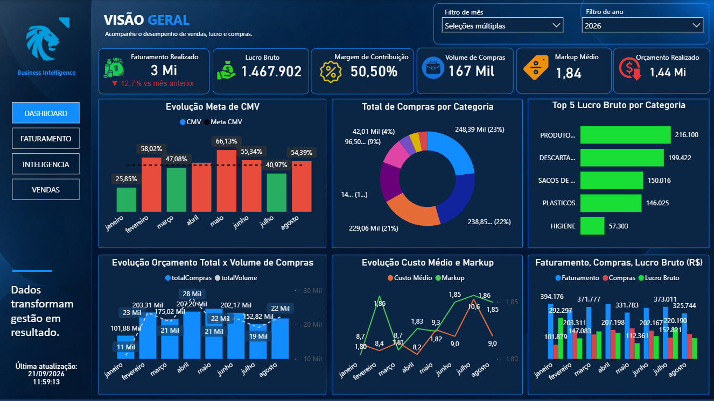
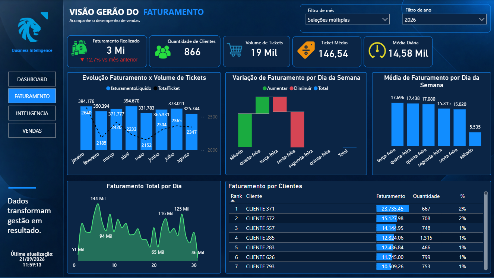
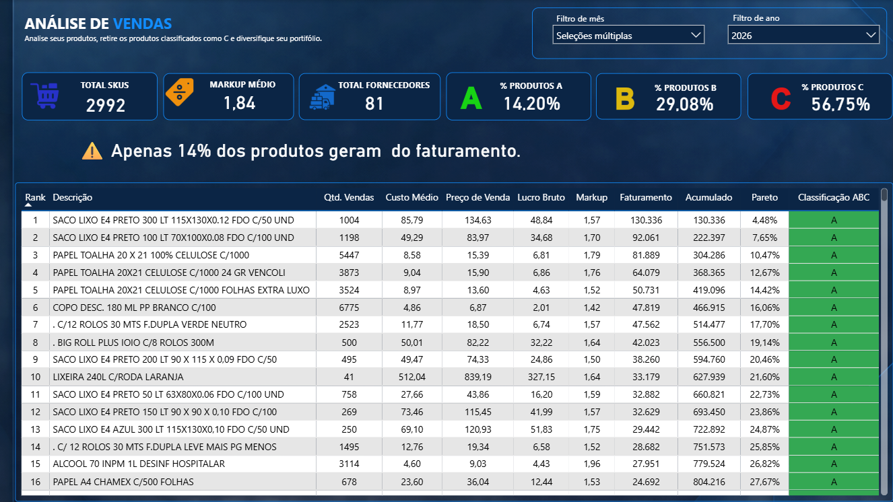
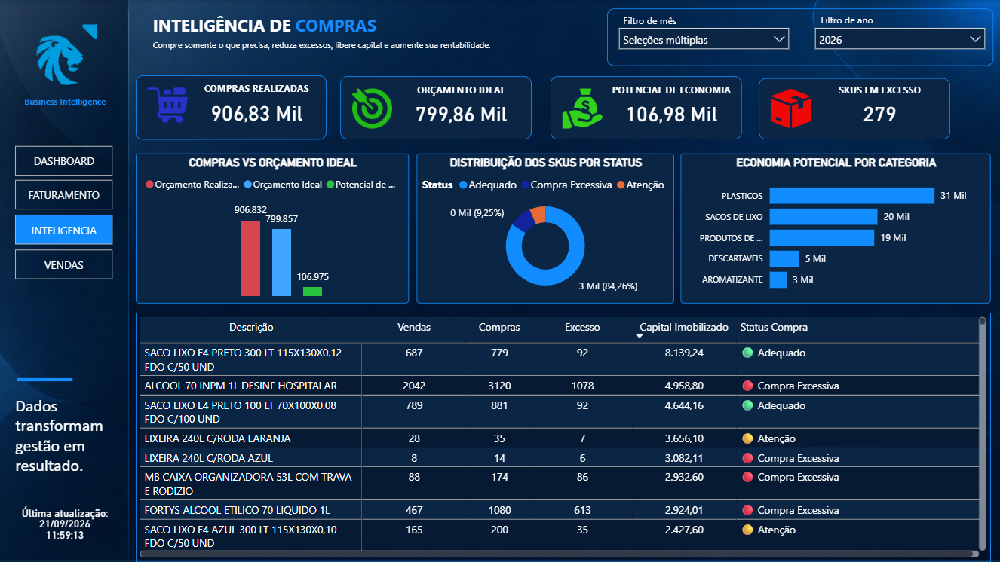

# Business Intelligence para Atacado & Varejo

> Dashboard desenvolvido em Power BI para transformar dados de vendas e compras em informações estratégicas para redução de custos, otimização do mix de produtos e identificação de oportunidades comerciais.


---

## 📌 Visão geral

Operações de atacado e varejo trabalham com grandes volumes de produtos, compras e vendas.

O desafio não está apenas em acompanhar o faturamento, mas em entender **onde o dinheiro está sendo gerado, onde está sendo imobilizado e onde existem oportunidades de eficiência**.

Este projeto apresenta uma solução de Business Intelligence desenvolvida em Power BI para integrar essas informações e apoiar decisões relacionadas a vendas, compras, mix de produtos e custos.

---

## 🎯 Objetivo do projeto

O BI foi desenvolvido para responder perguntas como:

- Quais produtos concentram o faturamento?
- Quais SKUs possuem baixa relevância?
- Onde existem oportunidades de redução de compras?
- Quais fornecedores concentram os gastos?
- Como as vendas se comportam ao longo da semana?
- Como a demanda varia durante o mês?
- Onde pode existir excesso de compras?
- Quais produtos e categorias merecem maior atenção?

---

## 📊 Principais análises

### Vendas

- Evolução do faturamento
- Faturamento por produto
- Faturamento por categoria
- Ticket médio
- Análise por dia da semana
- Análise ao longo do mês
- Participação dos produtos no faturamento

### Compras

- Evolução das compras
- Compras por fornecedor
- Compras por categoria
- Volume adquirido
- Participação dos fornecedores
- Identificação de oportunidades de redução

### Curva ABC

A Curva ABC permite identificar a relevância dos produtos dentro do faturamento.

A partir dessa classificação, produtos de menor participação podem ser avaliados para:

- redução de estoque;
- revisão do mix;
- redução de SKUs;
- compras sob demanda;
- retirada de produtos de baixa relevância.

### Capital imobilizado

Comprar mais não significa necessariamente vender mais.

A análise conjunta de compras e vendas permite investigar situações em que o volume adquirido não acompanha o comportamento da demanda.

Isso pode ajudar a identificar oportunidades para:

**reduzir excessos → liberar capital → melhorar eficiência operacional.**

---

## 💡 Storytelling do projeto

### 01 — Entender as vendas

Primeiro, o BI permite identificar **o que está sendo vendido e quando a demanda acontece**.

↓

### 02 — Identificar os produtos relevantes

A Curva ABC mostra quais produtos concentram o faturamento e quais possuem menor participação.

↓

### 03 — Revisar o mix

Produtos de baixa relevância podem ser avaliados para redução de SKUs, evitando complexidade e estoque desnecessário.

↓

### 04 — Analisar as compras

A comparação entre comportamento de vendas e compras ajuda a identificar excessos e oportunidades de negociação.

↓

### 05 — Gerar eficiência

O objetivo final é utilizar os dados para apoiar decisões que possam contribuir para:

**menos excesso + menos capital imobilizado + maior eficiência operacional.**

---
## 💰 Impacto potencial para o negócio

O objetivo do projeto é transformar análise de dados em ações que possam gerar eficiência operacional e financeira.

### Redução de SKUs

A Curva ABC permite identificar produtos de baixa participação no faturamento.

Esses produtos podem ser avaliados individualmente para:

- revisão do mix;
- redução de estoque;
- redução da variedade;
- alteração da frequência de compra;
- retirada de itens de baixa relevância.

### Redução de excessos

A análise conjunta de vendas e compras permite investigar situações em que o volume adquirido não acompanha a demanda.

Isso pode contribuir para:

**menos excesso → menor capital imobilizado → maior eficiência.**

### Planejamento de compras

A análise do comportamento das vendas por dia da semana e período do mês permite identificar padrões de demanda.

Essas informações podem apoiar:

- planejamento de compras;
- definição de níveis de estoque;
- frequência de abastecimento;
- negociação com fornecedores.

### Identificação de oportunidades

A combinação de vendas, compras, produtos e fornecedores permite direcionar a investigação para pontos como:

- produtos de baixa saída;
- concentração de compras;
- variações de demanda;
- oportunidades de negociação;
- excesso de aquisição;
- concentração de faturamento em determinados SKUs.

> **O objetivo do BI não é apenas mostrar o que aconteceu. É ajudar a identificar onde investigar o que pode ser melhorado.**

---

## 🔎 Indicadores e recursos

- Faturamento
- Ticket médio
- Evolução de vendas
- Análise temporal
- Curva ABC
- Participação acumulada
- Análise de compras
- Análise de fornecedores
- Análise de produtos
- Análise de categorias
- Indicadores de oportunidade

---

## 🛠️ Tecnologias

- **Microsoft Power BI**
- **DAX**
- **Power Query**
- **Modelagem de dados**
- **Business Intelligence**
- **Data Analytics**
- **Data Visualization**

---
## 🖥️ Dashboard

### Visão Geral



### Análise de Vendas



### Curva ABC



### Oportunidades



---

👨‍💻 Autor

Pedro Landgraf

Business Intelligence | Data Analytics

---

## 🗂️ Estrutura do projeto

```text
bi-atacado-varejo/
│
├── dashboard/
│   └── BI_Atacado_Varejo.pbit
│
screenshots/
├── dashboard.varejo.png
├── faturamento.varejo.png
├── curva.abc.varejo.png
└── inteligencia.varejo.png
│
├── docs/
│   └── metodologia.md
│
└── README.md
